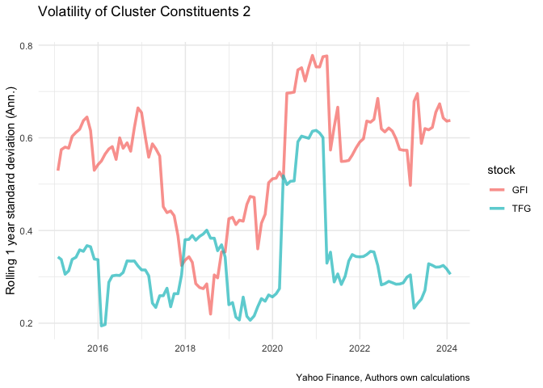
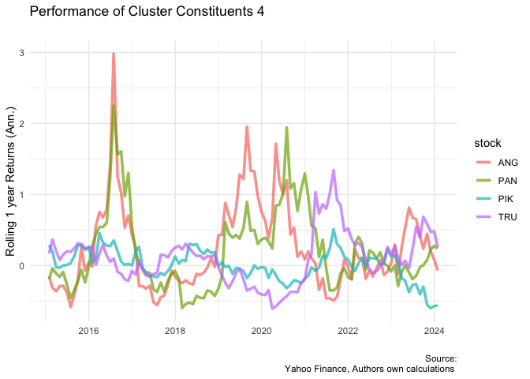

FMX Project
================

# Goal

Model an *edge* that serves a pre-requiste to structuring trades. I want
to be able to quickly identifying charcateristics in groups of stock
given some factors.

# Clustering to Create Smart Portfolio

## Roadmap

I want to use a combination of clustering and factor analysis.
Essentially, I want to reduce the dimensions of our sample data, making
it easier to uncover latent relationships in asset performance over
various time periods. For this, I will use K means clustering, as it
presents for an interesting technique to reduce dimensions and cluster
stock into groups with similar characteristics. Yes, the major
disadvantage is that it is suspectible to produce unstable clusters but
this is a feature that makes it interesting, the modeler can produce
unique results thus providing an *edge*.

## Metrics used

To assess performance, first I will use a simple look-back period to
observe performance and risk over 3, 6, and 12 months. Subsequently, we
conduct a rolling backtest over the sample period to evaluate the
robustness of the cluster characteristics formed through our factor
filter.

## Proposed Data & Methodology

- use historical stock price data sourced from Bloomberg, transform to
  monthly data by considering EOM observations.

- perform additional transformations on historical prices to obtain
  momentum and volatility measures. That is, filter top 40 stock by 200D
  moving average. Following this rank stock by 12 month return (momentum
  ), 100D trailing SD. (For this study we dont include fundmental data,
  due to the effort of cleaning data, which is beyond the scope of this
  project but could be explored further for more meaningful results).
  Apply a percentile scoring relative to the factors.

- Apply K-means. (clusters are formed on a euclidean distance, how then
  do you interpret the characteristics of the clusters)

- Filter each clusters stocks by the top n stock (this depends on the
  size of the factors) relative momentum values).

- Conduct a return and risk attribution to each clusters by back
  testing. Re-balancing quarterly, this would be my out sample testing

# Lets Start

``` r
 rm(list = ls()) # Clean your environment:
gc() # garbage collection - It can be useful to call gc after a large object has been removed, as this may prompt R to return memory to the operating system.
```

    ##          used (Mb) gc trigger (Mb) limit (Mb) max used (Mb)
    ## Ncells 471763 25.2    1013192 54.2         NA   669402 35.8
    ## Vcells 887594  6.8    8388608 64.0      16384  1851988 14.2

``` r
require("pacman")
p_load("tidyquant", "fmxdat", "tidyverse", "PerformanceAnalytics", "lubridate", "DEoptim", "data.table", "covFcatorModel", "gt", "factoextra", "foreach")

list.files('code/', full.names = T, recursive = T) %>% .[grepl('.R', .)] %>% as.list() %>% walk(~source(.))
```

# Retrieving the data

# Cleaning the data

# Prepping data for the K- Means Clustering

<!-- --><!-- -->

# Cluster constituent review

I want to get an idea of cluster constituent characteristics, that way I
can better describe aggregate charcateristics.

``` r
# lets get rid of all the very volatile stock 

volatile_stock <- cluster.merging %>% 
  mutate(Y = format(date, "%y") ) %>% 
  group_by(stock, Y) %>%
  mutate(ret = px/lag(px)-1) %>%  
  summarize(date = last(date), SD = sd(ret, na.rm = T)*sqrt(12)) %>%
  filter(SD>1) %>%
  select(stock) %>%
  distinct() %>% 
  pull()

# from this i can see that there are stock that have extreme volatility, lets filter out those that can compl

# from the results that we got from our initial cluster, let do some analysis

stock_analysis_data <- cluster.merging %>% filter(!stock %in% volatile_stock) %>% 
  select(date, cluster, stock) %>% 
  merge(., JSE_data %>% rename(stock = ticks), c("stock", "date")) %>% 
  filter(!is.na(cluster)) %>%
  select(-Company, -vol) %>%
  mutate(stock = str_remove(stock, ".JO"))

# lets find out returns and volatility by cluster and sector 

Rolling_return_split <- stock_analysis_data %>% 
  group_by(stock) %>%
  mutate(ret = px/lag(px)-1) %>% 
  mutate(RollRets = RcppRoll::roll_prod(1 + ret, 12, fill = NA, 
    align = "right")^(12/12) - 1) %>% 
group_by(date) %>% 
  filter(any(!is.na(RollRets))) %>% 
ungroup() 

# write a loop function that gets the data and plots it

plot_return_list <-  list()

#
Rolling_return_list <- Rolling_return_split %>%group_by(cluster) %>%  group_split()

for (i in seq_along(Rolling_return_list)) {
  
  df <- Rolling_return_list[[i]] %>% as.tibble()
  
  g <- df %>% 
    ggplot() + 
    geom_line(aes(date, RollRets, color = stock), alpha = 0.7, 
    size = 1.25) + 
    labs(title = paste("Performance of Cluster Constituents", i), 
    subtitle = "", x = "", y = "Rolling 1 year Returns (Ann.)", 
    caption = "Source:\n Yahoo Finance, Authors own calculations ") + theme_minimal()
  
plot_return_list[[i]] <- g
}

# create a loop to save
for (i in seq_along(plot_return_list)) {
  png(paste0("data/returnplots_", i, ".png"), width = 400, height = 250)
  plot(plot_return_list[[i]])
  dev.off()
}

plot_volatility_list <-  list()


Rolling_sd_split <- stock_analysis_data %>% 
  group_by(stock) %>%
  mutate(ret = px/lag(px)-1) %>% 
mutate(RollSD = RcppRoll::roll_sd(1 + ret, 12, fill = NA, align = "right") * 
    sqrt(12)) %>% 
filter(!is.na(RollSD))
# write a loop function that gets the data and plots it

plot_sd_list <-  list()

#

Rolling_sd_list <- Rolling_sd_split %>%group_by(cluster) %>%  group_split()

plot_sd_list <- list()  # Initialize an empty list to store the plots

for (i in seq_along(Rolling_sd_list)) {
  df <- Rolling_sd_list[[i]] %>% as.tibble()
  
  g <- df %>% 
    ggplot() + 
    geom_line(aes(date, RollSD, color = stock), alpha = 0.7, size = 1.25) + 
    labs(
      title = paste("Volatility of Cluster Constituents", i),
      subtitle = "",
      x = "",
      y = "Rolling 1 year standard deviation (Ann.)",
      caption = "Yahoo Finance, Authors own calculations"
    ) + theme_minimal()
  
  plot_sd_list[[paste("Cluster", i)]] <- g
}

for (i in seq_along(plot_sd_list)) {
  png(paste0("data/volplots_", i, ".png"), width = 400, height = 250)
  plot(plot_sd_list[[i]])
  dev.off()
}

plot_sd_list
```

    ## $`Cluster 1`

<!-- -->

    ## 
    ## $`Cluster 2`

<!-- -->

    ## 
    ## $`Cluster 3`

<!-- -->

    ## 
    ## $`Cluster 4`

<!-- -->

``` r
plot_return_list
```

    ## [[1]]

<!-- -->

    ## 
    ## [[2]]

<!-- -->

    ## 
    ## [[3]]

<!-- -->

    ## 
    ## [[4]]

<!-- --> - in tabular
format, get the industries, annualized return & risk, together with the
range. This will give an idea of portfolio characteristics.

# Backtesting

From the constituent review, I noticed through the rolling return and
risk metrics there was some consistency amongst constituents in
clusters. This gives some encouragement that constituents have some
commonalities in their risk/return profile over 12 months. Therefore
carrying on this theme, I will filter out the volatile stock to get an
idea of the clusters, and see how long these factors work or not.

``` r
# from the original dataframe get the rebalancing dates 
monthly_data <-
cluster.merging %>% filter(!stock %in% volatile_stock) %>% 
  group_by(stock) %>% 
  mutate(rtn = px/ lag(px)-1) %>%
  slice(-1)

# get the rebalancing dates

df <- monthly_data

Rebalance_Days <- df %>% 
  
  mutate(Year = format(date, "%Y"), Month = format(date, "%b"), YM = format(date, "%y %b")) %>% 
  
  filter(Month %in% c("Mar", "Jun", "Sep", "Dec")) %>% 
  
  select(date, Year,  Month, YM ) %>% unique() %>% 
  
  group_by(YM) %>% 
  
  filter(date == last(date)) %>% 
  
  filter( date == last(date)) %>% distinct(date) %>% 
  
  pull(date)


# now for gettiing the top 3 stock in each cluster that way we have a a single capping objective 

rebalance_col <-
  
  df %>% 
  
  filter(date %in% Rebalance_Days) %>% 
  
  # Now we have to distinguish rebalances - to create something to group by:
  mutate(RebalanceTime = format(date, "%Y%B")) %>% 
  
  # Now we can group...
  group_by(RebalanceTime, cluster) %>% summarise(date = date, stock,  weight = vol/sum(vol) ) %>% 
  
  filter(!is.na(weight)) %>% 
  
  # Now trim down to 30 stocks and reweight so sum(w)=1
  arrange(desc(weight)) %>% 
  
  top_n(3, weight) %>% 
  
  mutate(weight = weight/sum(weight)) %>%
  
  ungroup() %>% 
  
  arrange(date)

# get unique stock to filter in the main dataframe 
uniquestock <- rebalance_col %>% select(stock) %>% distinct() %>% pull()

cappedmonthly <-  monthly_data %>% filter(stock %in% uniquestock & date %in% Rebalance_Days & !stock %in% volatile_stock)

# now lets cap each at 30% 

Cap <- rebalance_col %>% 
  # Split our df into groups (where the groups here are the rebalance dates:
  group_split(RebalanceTime, cluster) %>% 
  
  # Apply the function Proportional_Cap_Foo to each rebalancing date:
  map_df(~Proportional_Cap_Foo(., W_Cap = 0.5) ) %>%
  
  select(-RebalanceTime)
  
static_backtest_performance <- left_join(Cap,cappedmonthly , c("stock", "date", "cluster"))

# to get the cluster returns we aggregate individual stock return into the cluster returns

cluster_return_df <- static_backtest_performance %>%  
  group_by(date, cluster) %>% 
  mutate(weighted_return = weight * rtn) %>%
  select(cluster, date, weighted_return) %>%
  group_by(date, cluster) %>% 
  summarize( cluster_return = sum(weighted_return))
```

## Return Attribution

In hindsight, how well did the clusters perform, relative to the JSE all
share?

- give this information we can charcaterize our clusters and construct
  cluster portfolios to study aggregate charcateristics.

``` r
# get some stats on the portfolios that you just constructed
Ports <- cluster_return_df %>% 
  tbl2xts::tbl_xts(cols_to_xts = cluster_return, spread_by = cluster) %>%
  tbl2xts::xts_tbl()
# not entirely thrilled about doing this
Ports[is.na(Ports)] <- 0

# now for the function to gather to give some stats on performance 
BMxts <- getSymbols('^J203.JO', src = "yahoo", from = "2014-01-01", to = Sys.Date(), auto.assign = TRUE)

BM <- Cl(getSymbols.yahoo('^J203.JO', auto.assign = FALSE)) %>%
  tbl2xts::xts_tbl() %>% rename(BM = J203.JO.Close) %>% 
  mutate(YM = format(date, "%y %m")) %>% group_by(YM) %>% 
  filter(date == last(date)) %>%
  ungroup() %>% 
  mutate(BM = BM/lag(BM)-1) 
# Merge the two dataframes together, 

all_funds <- left_join(Ports, BM, "date") %>% select(-YM)

all_funds[is.na(all_funds)] <- 0

# create a look back function that gives performance statistics

Moments_Comp <- function(funds, Months_LookBack){
  
     funds_considered <- 
     funds %>% filter(date >= fmxdat::safe_year_min(datesel = last(date), N = Months_LookBack)) %>% 
       gather(Tickers, Ret, -date)
     # get a vector of names to convert to xts
     clusters <- funds %>% gather(tick, ret, -date) %>% select(tick) %>% filter(tick != "BM") %>% pull()
bm <- funds %>% gather(tick, ret, -date) %>% select(tick) %>% filter(tick == "BM") %>% pull()
    
     Fundxts <- 
      funds_considered  %>% filter(Tickers %in% clusters) %>% 
      tbl2xts::tbl_xts(cols_to_xts = Ret, spread_by = Tickers, Colnames_Exact = T)
     # this means that y
      BMxts <- 
      funds_considered %>% filter(Tickers %in% bm) %>% 
      tbl2xts::tbl_xts(cols_to_xts = Ret, Colnames_Exact = T) 
     
library(PerformanceAnalytics)
    
  Moms <- 
      bind_rows(data.frame(PerformanceAnalytics::Return.annualized.excess(Fundxts, BMxts) ) %>% round(., 3),
        data.frame(PerformanceAnalytics::AdjustedSharpeRatio(Fundxts) ) %>% round(., 3),
        data.frame(AverageDrawdown(Fundxts, scale = 12)) %>% round(., 3),
        
         data.frame(TrackingError(Ra = Fundxts, Rb = BMxts, scale = 12)) %>% round(., 3), 
         data.frame(PerformanceAnalytics::CAPM.beta(Ra = Fundxts, Rb = BMxts, Rf = 0)) %>% round(., 3),
         data.frame(PerformanceAnalytics::CAPM.beta.bull(Ra = Fundxts, Rb = BMxts, Rf = 0)) %>% round(., 3),
         data.frame(PerformanceAnalytics::CAPM.beta.bear(Ra = Fundxts, Rb = BMxts, Rf = 0)) %>% round(., 3)
         # # data.frame(PerformanceAnalytics::UpDownRatios(Ra = Fundxts, Rb = BMxts, method = "Percent", side = "Up")) %>% round(., 3),
         # data.frame(PerformanceAnalytics::CVaR(R = Fundxts, p = 0.05, method = "modified")) %>% round(., 3)
        ) %>%  tibble::rownames_to_column("Info") %>%
        mutate(Period = glue::glue("Last {Months_LookBack} Months"), Info = c("Returns Excess (Ann.)", "Adj. Sharpe Ratio", "Avg DD", "Tracking Error", "Beta", "Beta Bull", "Beta Bear")) %>% 
        relocate(Period, .before = Info) %>% as_tibble() 

  colnames(Moms) <- gsub("comp_rtn_", "Portfolio ", colnames(Moms))
  
  Moms
  }
  

# create the group statistics

Tab_stats <-bind_rows(Moments_Comp(all_funds, 3), Moments_Comp(all_funds, 6), Moments_Comp(all_funds, 12)) %>%group_split(Period)


for (i in seq_along(Tab_stats)) {
  saveRDS(Tab_stats[[i]], file = paste0("data/Period_", i, ".rds"))
}
```

# Rolling Backtest

- take the clusters formed the backward looking analysis and test them
  on a series investment horizons. How long this strategy works and why,
  but the why bit links to the constituents.

``` r
# to avoid null datasets, filter out 2024

clusteringdata <- clusteringdata %>%
  filter(date <= ymd(20231231) & !stock %in% volatile_stock)

start_date <- clusteringdata %>% 
  filter(date == first(date)) %>% 
  select(date) %>% 
  distinct() %>% 
  pull()

# get the end dates which will mark the end of our investment horizon
end_dates <- clusteringdata %>% 
  mutate(Y = format(date, "%Y")) %>% 
  group_by(Y) %>% 
  filter(date == last(date)) %>% 
  ungroup() %>% 
  select(date) %>% 
  distinct() %>% 
  pull()

# get different investment horizons by creating multiple datasets
investment_horizon_dfs <- list()

for (end_date in unique(end_dates)) {
  df <- cluster.merging %>%
    filter(date >= start_date & date <= end_date) %>%
    arrange(date) %>% 
    select(-Company, -Sector, -YM) %>%
    group_by(stock) %>%
    mutate(rtn = px/lag(px) - 1) %>% 
    slice(-1)

  # Use the current end_date in the list assignment
  investment_horizon_dfs[[as.character(end_date)]] <- df
}

# from our ranking.df 
  
  # Extract stock names
  names <- ranking.df %>% select(stock)
  
  # Extract and prepare data for clustering
  cluster_data <- ranking.df %>% ungroup() %>% select(-stock)
  rownames(cluster_data) <- as.character(names$stock)
  
  # Determine the optimal number of clusters using silhouette method
  a <- fviz_nbclust(cluster_data, kmeans, method = "silhouette")
  silhouette <- a$data %>% tibble()
  silhouette$clusters <- as.numeric(silhouette$clusters)
  value <- silhouette %>% filter(y == max(y)) %>% select(clusters) %>% pull()
  
  # Perform k-means clustering
  km_res <- kmeans(cluster_data, value, nstart = 1000, algorithm = "Lloyd")
  
  clusters.names <- data.frame(
    stock = names$stock,
    clusters = km_res$cluster )
  
# portfolio list

# Merge corresponding clusters with investment_horizon_dfs
cluster_portfolio <- lapply(1:length(investment_horizon_dfs), function(i) {
  # Merge based on the "stock" column
  merged_df <- merge(investment_horizon_dfs[[i]], clusters.names, by = "stock")
})
```

``` r
# now see performance given our capping methodology
# at the rebalancing date you want to take the top n of each clusters and reweight. 

# rolling backtest 

rolling_Backtest <- list()
  
for (i in seq_along(investment_horizon_dfs)) {
  
  investment_horizon <- investment_horizon_dfs[[i]]  # Use the loop variable to access different investment horizons
  
 
 df <- investment_horizon

Rebalance_Days <- df %>% 
  
  mutate(Year = format(date, "%Y"), Month = format(date, "%b"), YM = format(date, "%y %b")) %>% 
  
  filter(Month %in% c("Mar", "Jun", "Sep", "Dec")) %>% 
  
  select(date, Year,  Month, YM ) %>% unique() %>% 
  
  group_by(YM) %>% 
  
  filter(date == last(date)) %>% 
  
  filter( date == last(date)) %>% distinct(date) %>% 
  
  pull(date)


# now for getting the top 3 stock in each cluster that way we have a a single capping objective, and to make this work, I assume that I create a volume weighted index, that at each rebalancing date the index is capped. 

rebalance_col <-
  
  df %>% 
  
  filter(date %in% Rebalance_Days) %>% 
  
  # Now we have to distinguish rebalances - to create something to group by:
  mutate(RebalanceTime = format(date, "%Y%B")) %>% 
  
  # Now we can group...
  group_by(RebalanceTime, cluster) %>% summarise(date = date, stock,  weight = vol/sum(vol) ) %>% 
  
  filter(!is.na(weight)) %>% 
  
  # Now trim down to 30 stocks and reweight so sum(w)=1
  arrange(desc(weight)) %>% 
  
  top_n(3, weight) %>% 
  
  mutate(weight = weight/sum(weight)) %>%
  
  ungroup() %>% 
  
  arrange(date)

# get unique stock to filter in the main dataframe 
uniquestock <- rebalance_col %>% select(stock) %>% distinct() %>% pull()

cappedmonthly <-  monthly_data %>% filter(stock %in% uniquestock & date %in% Rebalance_Days & !stock %in% volatile_stock)

# now lets cap each at roughly equal weighting which is 35%  

Cap <- rebalance_col %>% 
  # Split our df into groups (where the groups here are the rebalance dates:
  group_split(RebalanceTime, cluster) %>% 
  
  # Apply the function Proportional_Cap_Foo to each rebalancing date:
  map_df(~Proportional_Cap_Foo(., W_Cap = 0.35) ) %>%
  
  select(-RebalanceTime)
  
static_backtest_performance <- left_join(Cap,cappedmonthly , c("stock", "date", "cluster"))

# 

cluster_return_df <- static_backtest_performance %>%  
  group_by(date, cluster) %>% 
  mutate(weighted_return = weight * rtn) %>%
  select(cluster, date, weighted_return) %>%
  group_by(date, cluster) %>% 
  summarize( ret = sum(weighted_return)) %>% ungroup() %>% mutate(cluster = paste0("Cluster_", cluster))


rolling_Backtest[[i]] <- cluster_return_df
}
```

``` r
# from the results, lets get some perfromance metrics 

# clean our BM dataset
BM <- BM %>% 
  mutate(Year = format(date, "%Y"), Month = format(date, "%b"), YM = format(date, "%y %b")) %>% 
  filter(Month %in% c("Mar", "Jun", "Sep", "Dec")) %>% 
  select(date, BM) 

rolling_results <- list()

for (i in seq_along(rolling_Backtest)) {

  rolling_backtest <- rolling_Backtest[[i]]

  df <- tbl2xts::tbl_xts(rolling_backtest, ret, cluster, Colnames_Exact = TRUE)
  
  bm <- BM %>% filter(date >= ymd(20140331)) %>%  tbl2xts::tbl_xts(., Colnames_Exact = TRUE)

  df[is.na(df)] <- 0
  
  bm[is.na(bm)] <- 0

  Moments <- bind_rows(data.frame(PerformanceAnalytics::Return.annualized.excess(df, bm, scale =4)) %>% round(., 3),
    data.frame(PerformanceAnalytics::TrackingError(Ra = df, Rb = bm, scale =4 ))%>% round(., 3),
    data.frame(PerformanceAnalytics::AdjustedSharpeRatio(df))%>% round(., 3),
    data.frame(PerformanceAnalytics::AverageLength(df))%>% round(., 0),
    data.frame( PerformanceAnalytics::maxDrawdown(df)%>% round(., 3))) %>%
        tibble::rownames_to_column("Metrics") %>%
        mutate("Investment Horizon" = glue::glue("{i} Year"), Info = c("Ann Excess Return", "Ann Tracking Error", "Adj. Sharpe Ratio", "DD Length", "Max DD")) %>% 
        relocate("Investment Horizon" , .before = Metrics) %>%  relocate("Info" , .before = Metrics) %>% as_tibble() %>% select(-Metrics)
  
rolling_results[[i]] <- Moments
}

rolling_results
```

    ## [[1]]
    ## # A tibble: 5 × 6
    ##   `Investment Horizon` Info              Cluster_2 Cluster_3 Cluster_4 Cluster_1
    ##   <glue>               <chr>                 <dbl>     <dbl>     <dbl>     <dbl>
    ## 1 1 Year               Ann Excess Return     0.343     0.303     0.343     0.355
    ## 2 1 Year               Ann Tracking Err…     0.049     0.041     0.049     0.05 
    ## 3 1 Year               Adj. Sharpe Ratio   NaN        -0.429   NaN         0.258
    ## 4 1 Year               DD Length             0         3         0         2    
    ## 5 1 Year               Max DD                0         0.065     0         0.018
    ## 
    ## [[2]]
    ## # A tibble: 5 × 6
    ##   `Investment Horizon` Info              Cluster_2 Cluster_3 Cluster_4 Cluster_1
    ##   <glue>               <chr>                 <dbl>     <dbl>     <dbl>     <dbl>
    ## 1 2 Year               Ann Excess Return     0.159     0.096     0.159     0.099
    ## 2 2 Year               Ann Tracking Err…     0.037     0.048     0.037     0.061
    ## 3 2 Year               Adj. Sharpe Ratio   NaN        -0.921   NaN        -0.936
    ## 4 2 Year               DD Length             0         7         0         3    
    ## 5 2 Year               Max DD                0         0.137     0         0.116
    ## 
    ## [[3]]
    ## # A tibble: 5 × 6
    ##   `Investment Horizon` Info              Cluster_2 Cluster_3 Cluster_4 Cluster_1
    ##   <glue>               <chr>                 <dbl>     <dbl>     <dbl>     <dbl>
    ## 1 3 Year               Ann Excess Return     0.103     0.116     0.103     0.154
    ## 2 3 Year               Ann Tracking Err…     0.051     0.06      0.051     0.085
    ## 3 3 Year               Adj. Sharpe Ratio   NaN         0.151   NaN         0.471
    ## 4 3 Year               DD Length             0        11         0         4    
    ## 5 3 Year               Max DD                0         0.137     0         0.116
    ## 
    ## [[4]]
    ## # A tibble: 5 × 6
    ##   `Investment Horizon` Info              Cluster_2 Cluster_3 Cluster_4 Cluster_1
    ##   <glue>               <chr>                 <dbl>     <dbl>     <dbl>     <dbl>
    ## 1 4 Year               Ann Excess Return     0.076     0.078     0.076     0.148
    ## 2 4 Year               Ann Tracking Err…     0.049     0.058     0.049     0.084
    ## 3 4 Year               Adj. Sharpe Ratio   NaN         0.019   NaN         0.728
    ## 4 4 Year               DD Length             0        15         0         4    
    ## 5 4 Year               Max DD                0         0.137     0         0.116
    ## 
    ## [[5]]
    ## # A tibble: 5 × 6
    ##   `Investment Horizon` Info              Cluster_2 Cluster_3 Cluster_4 Cluster_1
    ##   <glue>               <chr>                 <dbl>     <dbl>     <dbl>     <dbl>
    ## 1 5 Year               Ann Excess Return     0.061     0.05      0.061     0.112
    ## 2 5 Year               Ann Tracking Err…     0.058     0.062     0.058     0.102
    ## 3 5 Year               Adj. Sharpe Ratio   NaN        -0.14    NaN         0.504
    ## 4 5 Year               DD Length             0        19         0         4    
    ## 5 5 Year               Max DD                0         0.137     0         0.116
    ## 
    ## [[6]]
    ## # A tibble: 5 × 6
    ##   `Investment Horizon` Info              Cluster_2 Cluster_3 Cluster_4 Cluster_1
    ##   <glue>               <chr>                 <dbl>     <dbl>     <dbl>     <dbl>
    ## 1 6 Year               Ann Excess Return     0.05      0.02      0.05      0.094
    ## 2 6 Year               Ann Tracking Err…     0.058     0.077     0.058     0.098
    ## 3 6 Year               Adj. Sharpe Ratio   NaN        -0.376   NaN         0.474
    ## 4 6 Year               DD Length             0        23         0         5    
    ## 5 6 Year               Max DD                0         0.201     0         0.116
    ## 
    ## [[7]]
    ## # A tibble: 5 × 6
    ##   `Investment Horizon` Info              Cluster_2 Cluster_3 Cluster_4 Cluster_1
    ##   <glue>               <chr>                 <dbl>     <dbl>     <dbl>     <dbl>
    ## 1 7 Year               Ann Excess Return     0.043    -0.002     0.043     0.038
    ## 2 7 Year               Ann Tracking Err…     0.081     0.088     0.081     0.142
    ## 3 7 Year               Adj. Sharpe Ratio   NaN        -0.364   NaN        -0.027
    ## 4 7 Year               DD Length             0        27         0         6    
    ## 5 7 Year               Max DD                0         0.399     0         0.419
    ## 
    ## [[8]]
    ## # A tibble: 5 × 6
    ##   `Investment Horizon` Info              Cluster_2 Cluster_3 Cluster_4 Cluster_1
    ##   <glue>               <chr>                 <dbl>     <dbl>     <dbl>     <dbl>
    ## 1 8 Year               Ann Excess Return     0.038     0.005     0.038     0.041
    ## 2 8 Year               Ann Tracking Err…     0.079     0.088     0.079     0.134
    ## 3 8 Year               Adj. Sharpe Ratio   NaN        -0.262   NaN         0.02 
    ## 4 8 Year               DD Length             0        31         0         8    
    ## 5 8 Year               Max DD                0         0.399     0         0.419
    ## 
    ## [[9]]
    ## # A tibble: 5 × 6
    ##   `Investment Horizon` Info              Cluster_2 Cluster_3 Cluster_4 Cluster_1
    ##   <glue>               <chr>                 <dbl>     <dbl>     <dbl>     <dbl>
    ## 1 9 Year               Ann Excess Return     0.033     0.013     0.033     0.025
    ## 2 9 Year               Ann Tracking Err…     0.081     0.099     0.081     0.131
    ## 3 9 Year               Adj. Sharpe Ratio   NaN        -0.161   NaN        -0.046
    ## 4 9 Year               DD Length             0        35         0         9    
    ## 5 9 Year               Max DD                0         0.399     0         0.419
    ## 
    ## [[10]]
    ## # A tibble: 5 × 6
    ##   `Investment Horizon` Info              Cluster_2 Cluster_3 Cluster_4 Cluster_1
    ##   <glue>               <chr>                 <dbl>     <dbl>     <dbl>     <dbl>
    ## 1 10 Year              Ann Excess Return     0.03      0.012     0.039     0.033
    ## 2 10 Year              Ann Tracking Err…     0.078     0.095     0.083     0.125
    ## 3 10 Year              Adj. Sharpe Ratio   NaN        -0.152     0.51      0.018
    ## 4 10 Year              DD Length             0        39         0        10    
    ## 5 10 Year              Max DD                0         0.399     0         0.419

# Please note

- results on the readme and write may be different. clusters formed
  sometimes include other industries and assets despite my best efforts
  to hard set certain inputs.

Apart from that hope you enjoyed the read.
