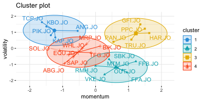
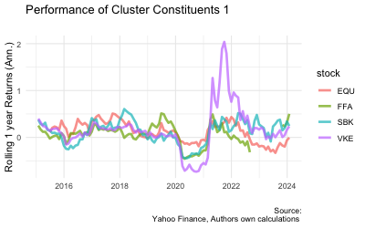

<!-- First: Set your default preferences for chunk options: -->

<!-- If you want a chunk's code to be printed, set echo = TRUE. message = FALSE stops R printing ugly package loading details in your final paper too. I also suggest setting warning = FALSE and checking for warnings in R, else you might find ugly warnings in your paper. -->

```{r setup, include=FALSE}
knitr::opts_chunk$set(echo = FALSE, message = FALSE, warning = FALSE, fig.width = 6, fig.height = 5, fig.pos="H", fig.pos = 'H')

require("pacman")
p_load("tidyquant", "fmxdat", "tidyverse", "PerformanceAnalytics", "lubridate", "DEoptim", "data.table", "covFcatorModel", "gt", "factoextra")

library(huxtable)
library(kableExtra)
library(xtable)
```

<!-- ############################## -->

<!-- # Start Writing here: -->

<!-- ############################## -->

# Introduction 

Consider the prevailing market consensus that anticipates a specific direction for market conditions. For instance, in the current interest rate environment, the majority of practitioners believe that in 2024, the Federal Reserve will initiate interest rate cuts. This could trigger a chain reaction in valuations across capital markets, affecting sectors and industries disproportionately. For investors, this underscores the importance of carefully scrutinizing different parts of the stock market to pinpoint companies that can enhance the risk/return profile of a portfolio. In this study, we employ a combination of K-Means clustering and technical factors to uncover latent relationships wih group of stock. Essentially, we reduce the dimensions of our sample data, to create "cluster portfolios" making it less challenging to uncover latent relationships in asset performance and group characteristics. 

Our initial assessment involves the utilization of a simple look-back period to observe performance and risk over 3, 6, and 12 months. This analysis reveals that, on average, cluster portfolios exhibit strong performance over short investment horizons. However, they also display significant risk levels when compared to a market index. To further evaluate the robustness of the portfolios formed through our factor filter, we conduct a rolling backtest. The findings suggest that, despite the elevated levels of risk, risk-adjusted performance, as measured by the Sharpe Ratio (SR) in Cluster 1 that was represented by three sectors, returns strong positive performance over short time horizons. Thus buttressing, our anlaysis from the lookback analysis. However, as the investment horizon extends, the superior risk adjusted return flatuates and diminishes with low positive SR.

This integrated approach of clustering and factor analysis provides a valuable toolkit for portfolio managers seeking to identify potential out performers admidst anticipated market shifts. The focus on reducing the complexity of the data allows for a more nuanced understanding of asset performance, with the potential for enhanced risk-adjusted returns in the short term. Nevertheless, the strategy's limitations in the context of number of factors underscore the importance of continual refinement and adaptation to better suit evolving market conditions.

The next section \ref{lit} offers a brief discription of the various unsupervised machine learning algorithms. Section \ref{meth} details the methodology and data used along with its preparation procedure to be utilized by the K means clustering algorithm. Section \ref{Results} discusses the results and sectiom \ref{con} offers the conclusion.

# Clustering and Appliactions to Asset Management \label{lit}

Clustering is the process of grouping objects based on similar characteristics. The algorithms designed to cluster, achieve this function by connecting observation through
distances, density of data points, graphs, or various statistical
distributions. This is a form of unsupervised machine learning, that searches for patterns in datasets with no pre-existing labels and a minimum of human intervention. For a cluster to have meaning an algorithm has to
maximize intra-cluster similarity and minimize inter-cluster similarity,
such that each cluster contains information that's as dissimilar to
other clusters[@kassambara2017practical]. There exists various forms of
cluster algorithms, each that addresses a broader task of analysis. The
algorithms can be divided into two main types being partitioning
clustering and hierarchical clustering. The major difference between the
divisions of clustering is the partition clustering aims to specify a
predetermined number of clusters whilst hierarchical clustering does not
[@kassambara2017practical]. Within partition clustering, for data with a
small set of variables, K-means clustering and partitioning around
medoids (PAM) are the most frequently used due to their fast compuation
and simplicity. With K-means, each cluster is represented by the center
or means of the data points belonging to the entire dataset. This makes
the algorithm sensitive to outliers. However with PAM, each cluster is
represented by one of the objects in the cluster. The other partition
clustering algorithm used for datasets with a  very large number of variables
is Clustering Large Applications (CLARA). 

In asset management, key to funds generating superior risk adjusted
returns is efficient portfolio diversification, thus presenting a great
application for partition clustering. Stocks would be separated into
groups through a clustering algorithm to maximize similarity within
groups and minimizes similarity between groups. Thus allowing managers
to select handpick stock to construct a diversified portfolio.
@marvin2015creating use fundamental ratios (turnover and profitability
ratios) weighted equally and K-means clustering to group US technology
stocks listed on the NASDAQ and NYSE. A diversified portfolio is then
constructed based on within cluster stock performance i.e. stock
selected are those that possess the highest Sharpe ratio. Results over a
period of 15 years that included the dot com bubble and the global
financial crises showed that cluster portfolios exhibited more
volatility than the benchmark (S&P 500), however returns to investors
were above the benchmark at multiples ranging from 3.5 to 5.7 times when
earnings are reinvested into the cluster portfolios. @bin2020k uses a
similar approach to @marvin2015creating, however employing a combination
of market ratios and fundamental ratios (price to earnings ratio, return
on assets ratio and asset turnover ratio ). From this study, compared to
the S&P 500, portfolios constructed using market ratios under performed
those that used fundamental ratios.

# Data and Methodology \label{meth}

This section describes how we obtain the data set used in the study,
details the clustering process and validating metrics employed, to
obtain the results in \ref{Results}. For the methodology results, see Appendix \ref{app1} and \ref{app2}.

## Obtaining and prepariing the dataset

The data employed in this paper is based on the constituent list of the
Johannesburg All Share Index (ALSI) from January 1, 2014 to January 29
2024. The historical price and volume data is
retrieved from Yahoo Finance. From
historical price data obtained from Yahoo Finance, we filter stock that
have trading volume that exceed 1 000 000 shares traded per year and
exclude stock that have less than 90 percent of observations in the
historical price dataset.

To avoid large oscillations in the data, we transformed the price series
to include end of month data points thus returns calculations are based
on from the monthly data. Monthly historical prices are transformed
using simple returns and we assume that embedded in the price action are
cooperate events such as stock splits or consolidations of the shares.
Therefore there is no need to make additional transformations on the
return series to reflect corporate actions.

The measures of similarity used in this study are volatility and price
momentum. To cluster stock based on the two measures, we apply a
percentile ranking criterion on stock scores during a time period. For
price momentum, describes the causality between relatively strong
performance and high future return and vice-versa. Ranking highly
implies that strong performers and thus higher returns than weak
performers. This study defines cross sectional momentum as the trailing
12 month cumulative return [@asness2011momentum & @jegadeesh1993returns], a modication to capture some longer term effects in the return series.
For volatility, using a 12 month lock back period compute the standard
deviation. The results of the ranking are shown in Table \ref{tab1}

## Stocks clustering

### Lloyd's algorithm

We employ the K-means that partitions $n$ observations into $k$ clusters. The goal is to minimize the within cluster sum of squares or
analytically, $\underset{s}{\arg \min } \sum_{i=1}^k \sum_{x \in S_i}\left\|x-\mu_i\right\|^2$ where $x$ are the observations, $S=S_1, S_2, \ldots, S_k$ are the sets
of observations, and $\mu_i$ is the mean of the points in $S_i$. To
arrive at the optimum number of clusters, we utilize the most popular
algorithm called the Lloyd's algorithm that is closely followed by
@marvin2015creating, @bin2020k & @xu2010clustering.

Analytically, given a set of points $\left\{x_1, \cdots x_n\right\}\left(x_i \in \mathbb{R}^m\right)$, Initialize the K clusters with $\left\{C_1, \cdots C_K\right\}$ with centers. $\left\{m_1, m_2, \cdots m_K\right\}\left(m_i \in \mathbb{R}^m\right)$. The centers are picked using the silhouette method discussed in \ref{sil} For all points $x_i(i \in\{1, \cdots n\})$, find the center that closest based on a euclidean distance $d$. Following this, assign $x_i$ to the cluster corresponding to the closest centre. Then $x_i \in C_j$ if $d\left(x_i, m_j\right) \leq d\left(x_i, m_l\right) \quad(\forall l \in\{1, \cdots K\})(j \neq l)(\forall i \in\{1, \cdots n\})$. Recalculate the center for each cluster $C_l(l \in\{1, \cdots K\})$. The new cluster centers are the mean of the points in the same cluster.

$m_l=\frac{1}{\left|C_l\right|} \sum_{x_p \in C_l} x_p \quad(\forall l \in\{1, \cdots K\})$.

Repeat processes two and three until no cluster has any change in point assignment.

## Silhoutte index \label{sil}

To evaluate the goodness of fit of partitioning using K means clustering
the silhoutte index is used [@rousseeuw1987silhouettes]. Given $n$ data points $\left\{x_1, \cdots x_n\right\}$, a partitioning result of $K$ cluster $\left\{C_1, \cdots C_K\right\}$ and distance metric $d$, for each $x_i$ in cluster $C_l$, define

$a\left(x_i\right)=\frac{1}{\left|C_l\right|-1} \sum_{\forall x_j \in C_l, i \neq j} d\left(x_i, x_j\right)$

$a(x_i)$ is the mean dissimilarity between $x_i$ to all other points within the same cluster.For each point $x_i$ in cluster $C_l$, define 

$b\left(x_i\right)=\min _{\forall p \in\{1, \cdots K\}, p \neq l} \frac{1}{\left|C_p\right|} \sum d\left(x_i, x_j\right.)$

$b(x_i)$ is the minimum dissimilarity between $x_i$ and all points in some $C_p$ which does not contain $x_i$. For each point $x_i$ in cluster $C_l$, their silhouette index is defined
as

$s\left(x_i\right)= \begin{cases}1-\frac{a\left(x_i\right)}{b\left(x_i\right)} & \text { if } a\left(x_i\right)<b\left(x_i\right) \\ 0 & \text { if } a\left(x_i\right)=b\left(x_i\right) \\ \frac{b\left(x_i\right)}{a\left(x_i\right)}-1 & \text { if } a\left(x_i\right)>b\left(x_i\right)\end{cases}$

where $s(x_i)$ ranges between $[-1, 1]$. For $s(x_i)$ that approaches 1, it means that $a(x_i)$ needs to be
significantly smaller than $b(x_i)$, implying that within-cluster mean
dissimilarity is much less than the smallest between-cluster mean
dissimilarity, and thus the model does a good job clustering similar
points together.

For the $s(x_i)$ that approaches 0, $a(x_i)$ needs to be significantly
greater than $b(x_i)$, implying that within-cluster mean dissimilarity
is much greater than the smallest between- cluster mean dissimilarity,
and thus the model does a poor job clustering similar points together.

For this study, we choose $K$ with the highest silhoutte index/value in Figure\ref{fig1} and gives the clusters in Figure \ref{fig2}
```{r, fig.align='left', fig.cap=" Silhoutte Indexes for Clusters \\label{fig1}", fig.ext='png', fig.height=2, fig.width=4}

```

```{r, fig.align='left', fig.cap=" Clusters Results from Highest Silhoutte \\label{fig2}", fig.ext='png', fig.height=2, fig.width=4}

```
## Portfolio Backtest \label{back}

The out-of-sample performance of cluster portfolios is compared to the benchmark, the JSE All Share Index. To manage risk exposure to a single asset or industry,  we use a cap  on each asset's allocation. Thus use a single company methodology similar to Standard & Poor Capping Methodology ^[see @sp for a breakdown of the process used to cap an index]. In a single company capping methodology, no company in an index (cluster in our case) is allowed to breach a certain pre-determined weight as of each rebalancing period ^[The maximum set for each stock in each cluster is its equal weight for that cluster i.e if there were 10 stock in cluster 1, the maximum weight would be 10%]. Theoretically, this should preserve the within cluster diversification benefits and allow the portfolio value to either increase or decrease depending on relative stock performance during the quarter however capping limit asset risk expsoure. We re balance the portfolios once every three months, similar to the frequency of rebalancing conducted by the JSE on the JSE/FTSE indices, that is, re balance on the last daty of March, June, September and December. 

# Results \label{Results}

This section will present and analyze the clustering results of the K-means algorithms. We will discuss constituent and cluster charcateristics, hence show how we can uncover latent relationship within stocks that based on factors that otherwise would be challenging.

## Constiutent Description in Clusters

In table \ref{tab1}, our ranking criterion and filtering lead to the inclusion of three sectors: Basic Materials, Consumer Services, and Financials. The ranking criterion assigns the highest score to stocks that perform the best based on the specified factors. For instance, a score close to 1 for the Price Momentum Rank indicates that a stock has exhibited the strongest price movement over the past 12 months, while a lower score suggests weaker performance. Similarly, for the Volatility Rank, a score close to 1 signifies a stock with lower volatility, and a lower score indicates higher volatility.

Examining Table \ref{tab1}, we observe that most stocks in the Financial sector rank high in return volatility, Consumer Services stocks rank low, and Basic Materials stocks rank even lower. Price Momentum ranks Basic Materials stocks across the spectrum of Price Momnetum Rank, this is similar for Financials and Consumer Services. Consequently, from the ranking, there is no clear grouping by sector in terms of both price and volatility.

Moving on to Table \ref{tab2}, where we apply K-means clustering and determine the appropriate number of clusters to be K = 4, as suggested by Figure \ref{fig1}. Notably, Cluster 2 predominantly comprises stocks from the Financial sector, while Cluster 1, Cluster 3, and Cluster 4 exhibit a mix of representation from all sectors except Financials. Additional details, including plots of rolling 12-month returns and rolling 12-month standard deviation, can be found in Appendix \ref{app2} ^[These plots illustrate similar movement in returns and volatility, providing insights into stock behavior over a one-year rolling period.It is important to note that these findings do not make a definitive case for a direct relationship among the securities but rather highlight the observed behavior over a specified time frame.]. From tables \ref{tab3}, \ref{tab4} and \ref{tab5} we notice that risk adjusted returns for the clusters are highest on the shortest look back period of 3 months. Within that period SR is highest for Cluster at 1.37, emphasizing that investor recieve more reward for undertaking a certain level of risk.

## Results from Rolling Backtest

Appendix \ref{app2} from \ref{tab3} to \ref{tab15} give a detailed results of our rolling backtest. We aim to evaluate the performance of these clusters over varying investment horizons, specifically focusing on relative risk and return perspectives in comparison to the JSE All Share Index. We add a modification to the methodology discussed in \ref{back} designing a weight column constructed from relative volume weighting. This approach ensures a thorough consideration of liquidity, emphasizing the most liquid stocks within each cluster and have weights to calulate execute our capping function. 

Upon analyzing the final results, a noteworthy trend emerges — the clusters consistently demonstrate positive excess returns relative to the benchmark. When holding the same clusters across investment horizons ranging from 1 to 10 years, it becomes apparent that excess returns are maximized in the shorter time frames. Specifically, over the short-term (1 year from table \ref{tab4}), clusters generate superior excess returns ranging from 30% to 57%, followed by 8.2% to 10.8% in the medium term (5 years from table \ref{tab9}, and 4.8% to 5.6% over the ultra-long term (10 years from table \ref{tab15}). 

We notice consistency once we study the tracking error. Over the short term, tracking errors range from 1.8% to 7.9%, followed by 10.2% to 10.9% in the medium term, and 9.9% to 11.6% in the long term. This highlights the varying degrees of risk associated with the clusters across different investment horizons. However, this tracking error largely remains in tight ranges through the investment horizons, thus displaying ability for cluster portfolios to take consistent amount of risk relative to the benchmark. 

Examining risk-adjusted metrics, we observe that clusters achieve a high Sharpe Ratio (SR) of 2.3 in the short term. As the investment horizon extends, the SR remains generally low but positive, suggesting that, while the clusters may exhibit lower risk-adjusted returns over longer periods, they continue to outperform in terms of risk efficiency in the shorter term.

Lastly, Cluster 1 displays the least drawdowns and exhibits quick recovery to previous from its maximum drawdown, particularly in very short investment horizons. On the other hand, Cluster 3 consistently experiences a more moderate level of drawdowns and recovery rates. Notably, Clusters 1, 2, and 4 undergo a doubling of drawdowns from year 6 to year 7. However, over the long term, all clusters experience a comparable level of drawdowns, with Cluster 4 showcasing the most protracted recovery period from its down levels.

# Conclusion \label{con}

Our objective was to develop a methodology utilizing factors with theoretical foundations to unveil latent relationships among stocks and/or sectors through the application of the K-means algorithm. Additionally, we delved into return and risk metrics from a retrospective standpoint, constructing a rolling backtest to assess the robustness of the clustering results.

The obtained results indicate that cluster portfolios not only provide positive excess returns but also demonstrate consistency in risk relative to the benchmark. Over short periods, these portfolios generate above-average risk-adjusted returns, albeit with the exception of the lone high value observed in Cluster 1 over a one-year investment holding period. A nuanced examination of the formed clusters reveals several important discoveries from our study. We found that as the investment horizon extends, maximum drawdowns for all clusters, in general, remained the same. However, at year 6 to 7, all but Cluster 3 had their maximum drawdowns increase. A deeper investigation could reveal valuable insight into risk drivers for the clusters. 

Second, a single industry can make up an entire cluster, while a mix of industries can compose another. These findings could be interpreted in various ways; for instance, clusters with sector concentration and large drawdowns could signal great sensitivity to systematic risk attached to that sector. On the other hand, diverse clusters could imply greater opportunities for sectoral rotation, depending on investor capital expectations.

We used price momentum and volatility factors, but other factors could be used to study group characteristics, thus showing the power of clustering and factor analyses. In conclusion, to enhance the comprehensiveness of this study, the inclusion of additional factors, particularly fundamental ones, in our K-means clustering framework could be considered. Furthermore, testing various partition algorithms for their ability to form clusters with high orthogonal risk drivers would contribute to a more thorough analysis.

\newpage

# References

::: {#refs}
:::

\newpage

# Appendix

## Appendix A\label{app1}

```{r echo=FALSE, message=FALSE, warning=FALSE, results='asis'}

ranking.df <- read_rds("data/bob.rds") 
# ranking table
ranking_table <- ranking.df %>% rename('Volatility  Rank' = volatility, "Price Momentum Rank" = momentum) %>% mutate(stock = str_remove(stock, ".JO")) %>% rename(Ticker = stock)

table <- xtable(ranking_table, caption = "Stock Ranking By Factors \\label{tab1}")
  print.xtable(table,
             tabular.environment = "longtable",
             floating = TRUE,
             table.placement = 'H',
             # scalebox = 0.3,
             comment = FALSE,
             caption.placement = 'top'
             )
```

```{r echo=FALSE, message=FALSE, warning=FALSE, results='asis'}
data <- read_rds(file = "data/stockclassification.rds")
table <- xtable(data, caption = "Stock Classification by Sector and Cluster \\label{tab2}")
  print.xtable(table,
             # tabular.environment = "longtable",
             floating = TRUE,
             table.placement = 'H',
             # scalebox = 0.3,
             comment = FALSE,
             caption.placement = 'top'
             )
```

\newpage

\newpage
# Appendix B \label{app2}


```{r, fig.align='left', fig.cap=" Clusters Results from Highest Silhoutte \\label{fig2}", fig.ext='png', fig.height=2, fig.width=4}




knitr::include_graphics("images/returnplots_3.png")
```


```{r, fig.align='left', fig.cap=" Clusters Results from Highest Silhoutte \\label{fig2}", fig.ext='png', fig.height=2, fig.width=4}


```
\newpage
## Look Back 

```{r echo=FALSE, message=FALSE, warning=FALSE, results='asis'}
data <- read_rds(file = "data/Period_1.rds") %>% arrange(Info)
table <- xtable(data, caption = "LookBack Performance \\label{tab3}")
  print.xtable(table,
              tabular.environment = "longtable",
             floating = TRUE,
             table.placement = 'H',
             # scalebox = 0.3,
             comment = FALSE,
             caption.placement = 'top'
  )
```


```{r echo=FALSE, message=FALSE, warning=FALSE, results='asis'}
data <- read_rds(file = "data/Period_2.rds") %>% arrange(Info)
table <- xtable(data, caption = "LookBack Performance \\label{tab4}")
  print.xtable(table,
              tabular.environment = "longtable",
             floating = TRUE,
             table.placement = 'H',
             # scalebox = 0.3,
             comment = FALSE,
             caption.placement = 'top'
  )
```


```{r echo=FALSE, message=FALSE, warning=FALSE, results='asis'}
data <- read_rds(file = "data/Period_3.rds") %>% arrange(Info)
table <- xtable(data, caption = "LookBack Performance \\label{tab5}")
  print.xtable(table,
              tabular.environment = "longtable",
             floating = TRUE,
             table.placement = 'H',
             # scalebox = 0.3,
             comment = FALSE,
             caption.placement = 'top'
  )
```
\newpage

## Rolling Backtest Results 

```{r echo=FALSE, message=FALSE, warning=FALSE, results="asis"}
data <- read_rds(file = "data/rolling_1.rds") %>% as.data.frame()

# Create an xtable object
xt <- xtable(data, caption = "Rolling Performance Performance \\label{tab6}")

# Print the xtable object with formatting options
print(xt, 
      # tabular.environment = "longtable",
      floating = TRUE,
      table.placement = 'H',
      # scalebox = 0.3,
      comment = FALSE,
      caption.placement = 'top')
```


```{r echo=FALSE, message=FALSE, warning=FALSE, results='asis'}
data <- read_rds(file = "data/rolling_2.rds")  %>% as.data.frame()
table <- xtable(data, caption = "Rolling Performance Performance \\label{tab7}")
  print.xtable(table,
              tabular.environment = "longtable",
             floating = TRUE,
             table.placement = 'H',
             # scalebox = 0.3,
             comment = FALSE,
             caption.placement = 'top'
  )
```


```{r echo=FALSE, message=FALSE, warning=FALSE, results='asis'}
data <- read_rds(file = "data/rolling_3.rds") %>% as.data.frame()
table <- xtable(data, caption = "Rolling Performance Performance \\label{tab8}")
  print.xtable(table,
              tabular.environment = "longtable",
             floating = TRUE,
             table.placement = 'H',
             # scalebox = 0.3,
             comment = FALSE,
             caption.placement = 'top'
  )
```


```{r echo=FALSE, message=FALSE, warning=FALSE, results='asis'}
data <- read_rds(file = "data/rolling_4.rds") %>% as.data.frame()
table <- xtable(data, caption = "Rolling Performance Performance \\label{tab9}")
  print.xtable(table,
              tabular.environment = "longtable",
             floating = TRUE,
             table.placement = 'H',
             # scalebox = 0.3,
             comment = FALSE,
             caption.placement = 'top'
  )
```


```{r echo=FALSE, message=FALSE, warning=FALSE, results='asis'}
data <- read_rds(file = "data/rolling_5.rds") %>% as.data.frame()
table <- xtable(data, caption = "Rolling Performance Performance \\label{tab10}")
  print.xtable(table,
              tabular.environment = "longtable",
             floating = TRUE,
             table.placement = 'H',
             # scalebox = 0.3,
             comment = FALSE,
             caption.placement = 'top'
  )
```


```{r echo=FALSE, message=FALSE, warning=FALSE, results='asis'}
data <- read_rds(file = "data/rolling_6.rds") %>% as.data.frame()
table <- xtable(data, caption = "Rolling Performance Performance \\label{tab11}")
  print.xtable(table,
              tabular.environment = "longtable",
             floating = TRUE,
             table.placement = 'H',
             # scalebox = 0.3,
             comment = FALSE,
             caption.placement = 'top'
  )
```


```{r echo=FALSE, message=FALSE, warning=FALSE, results='asis'}
data <- read_rds(file = "data/rolling_7.rds") %>% as.data.frame()
table <- xtable(data, caption = "Rolling Performance Performance \\label{tab12}")
  print.xtable(table,
              tabular.environment = "longtable",
             floating = TRUE,
             table.placement = 'H',
             # scalebox = 0.3,
             comment = FALSE,
             caption.placement = 'top'
  )
```


```{r echo=FALSE, message=FALSE, warning=FALSE, results='asis'}
data <- read_rds(file = "data/rolling_8.rds") %>% as.data.frame()
table <- xtable(data, caption = "Rolling Performance Performance \\label{tab13}")
  print.xtable(table,
              tabular.environment = "longtable",
             floating = TRUE,
             table.placement = 'H',
             # scalebox = 0.3,
             comment = FALSE,
             caption.placement = 'top'
  )
```


```{r echo=FALSE, message=FALSE, warning=FALSE, results='asis'}
data <- read_rds(file = "data/rolling_9.rds") %>% as.data.frame()
table <- xtable(data, caption = "Rolling Performance Performance \\label{tab14}")
  print.xtable(table,
              tabular.environment = "longtable",
             floating = TRUE,
             table.placement = 'H',
             # scalebox = 0.3,
             comment = FALSE,
             caption.placement = 'top'
  )
```


```{r echo=FALSE, message=FALSE, warning=FALSE, results='asis'}
data <- read_rds(file = "data/rolling_10.rds") %>% as.data.frame()
table <- xtable(data, caption = "Rolling Performance Performance \\label{tab15}")
  print.xtable(table,
              tabular.environment = "longtable",
             floating = TRUE,
             table.placement = 'H',
             # scalebox = 0.3,
             comment = FALSE,
             caption.placement = 'top'
  )
```


